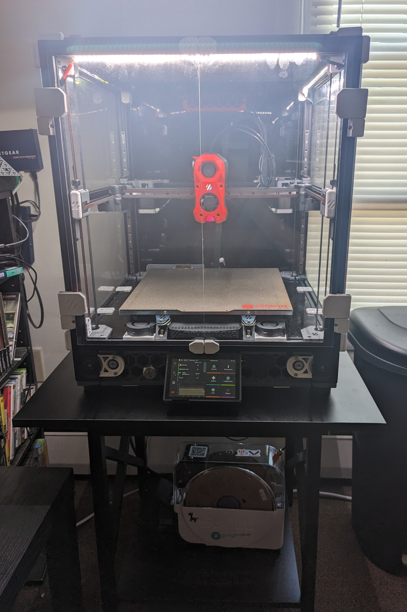

<!--
 Copyright (C) 2023 Chris Laprade (chris@rootiest.com)

 This file is part of Hephaestus.

 Hephaestus is free software: you can redistribute it and/or modify
 it under the terms of the GNU General Public License as published by
 the Free Software Foundation, either version 3 of the License, or
 (at your option) any later version.

 Hephaestus is distributed in the hope that it will be useful,
 but WITHOUT ANY WARRANTY; without even the implied warranty of
 MERCHANTABILITY or FITNESS FOR A PARTICULAR PURPOSE.  See the
 GNU General Public License for more details.

 You should have received a copy of the GNU General Public License
 along with Hephaestus.  If not, see <http://www.gnu.org/licenses/>.
-->

# Hephaestus (hephaestus)

by: [rootiest](https://github.com/rootiest)

This profile is for a Voron V2.4 300mm with TAP and a nozzle brush and a bunch of other stuff.

## Usage

    curl https://raw.githubusercontent.com/rootiest/printcfg/master/scripts/install.sh | bash -s -- hephaestus

## Features

- 300mm build volume
- Voron TAP probe
- Nozzle brush
- Nevermore Filter
- Exhaust Fan
- Bed fans
- Chamber sensor
- Filament sensor on toolhead (load detection possible)
- Door sensor
- Case lights (125 RGBW LEDs)
- StealthBurner LEDs (rainbow barf + RGBW LEDs)
- Beeper (for notifications)

## Notes

This is what I use on my personal machine.

## Photos

